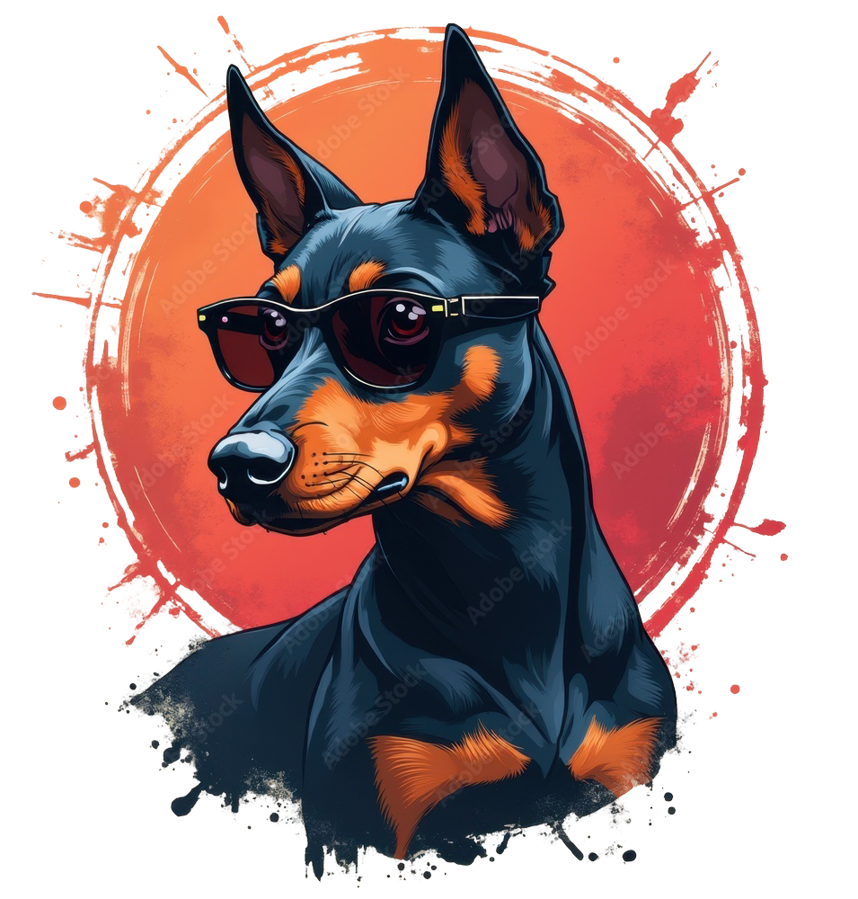

# Pawsitive Placements



## 🐾 About the Project

Pawsitive Placements is a comprehensive pet adoption platform designed to connect animals in need with loving forever homes. Our mission is to create meaningful connections between pets and potential adopters, streamline the adoption process, and provide valuable resources for pet owners.

## ✨ Features

### For Pet Adopters
- **Browse Available Pets**: Explore our extensive catalog of dogs, cats, and other animals looking for homes
- **Pet Filtering**: Find pets by category, breed, age, and other criteria
- **Detailed Pet Profiles**: View comprehensive information about each pet including health status, temperament, and background
- **Adoption Application**: Submit online applications to adopt your perfect companion
- **Success Stories**: Read heart-warming adoption testimonials from previous adopters
- **Nearby Pet Services**: Locate veterinary clinics and pet shops near your location
- **Donation System**: Support our cause through secure online donations

### For Administrators
- **Admin Dashboard**: Comprehensive control panel to manage all aspects of the platform
- **User Management**: Review and manage user accounts, applications, and permissions
- **Pet Listings Management**: Add, edit, and remove pet listings with ease
- **Application Review**: Process adoption applications efficiently
- **Payment Tracking**: Monitor donations and adoption fees

## 🛠️ Technologies Used

### Frontend
- **React**: UI building with functional components and hooks
- **Vite**: Fast build tool and development environment
- **React Router**: Navigation and routing throughout the application
- **Tailwind CSS**: Utility-first CSS framework for styling
- **DaisyUI**: Component library built on Tailwind
- **Framer Motion**: Animation library for smooth transitions and effects
- **React-Leaflet**: Interactive maps for the nearby pet services feature
- **Firebase Authentication**: Secure user authentication system
- **Axios**: HTTP client for API requests
- **React Helmet**: Document head manager for SEO optimization

### Backend Services
- **Firebase**: Authentication and cloud services
- **Stripe**: Secure payment processing for donations and adoption fees

## 🏗️ Project Structure

The application follows a clear, modular structure:

```
src/
├── assets/          # Static resources like images and icons
├── components/      # Reusable UI components
├── Dashboard/       # Admin dashboard views and components
├── firebase/        # Firebase configuration
├── hooks/           # Custom React hooks
├── Layout/          # Layout components like Header, Footer, and Navbar
├── Pages/           # Main page components
├── Provider/        # Context providers for state management
├── Router/          # Routing configuration
└── Shared/          # Shared utilities and components
```

## 🔑 Key Features in Detail

### Pet Browsing & Adoption
Users can browse pets by category, view detailed profiles, and submit adoption applications through an intuitive interface. Each pet has comprehensive information including photos, health status, age, and temperament.

### User Authentication & Profiles
Secure user registration and login via email/password or social media integration. Users can manage their profiles and track their adoption applications.

### Nearby Pet Services
An interactive map feature helps pet owners locate veterinary clinics and pet shops in their vicinity, making pet care more accessible.

### Donation System
A streamlined donation process allows supporters to contribute to the organization's mission with secure payment processing.

### Admin Dashboard
A powerful admin interface for managing pets, users, applications, and monitoring site performance through statistics and reports.

## 🚀 Getting Started

### Prerequisites
- Node.js (v14.0.0 or later)
- npm or yarn package manager

### Installation

1. Clone the repository
   ```bash
   git clone https://github.com/your-username/pawsitive-placements.git
   cd pawsitive-placements-client
   ```

2. Install dependencies
   ```bash
   npm install
   # or
   yarn install
   ```

3. Create a `.env` file in the root directory with the following environment variables:
   ```
   VITE_FIREBASE_API_KEY=your_firebase_api_key
   VITE_FIREBASE_AUTH_DOMAIN=your_firebase_auth_domain
   VITE_FIREBASE_PROJECT_ID=your_firebase_project_id
   VITE_FIREBASE_STORAGE_BUCKET=your_firebase_storage_bucket
   VITE_FIREBASE_MESSAGING_SENDER_ID=your_firebase_messaging_sender_id
   VITE_FIREBASE_APP_ID=your_firebase_app_id
   VITE_STRIPE_PUBLIC_KEY=your_stripe_public_key
   ```

4. Start the development server
   ```bash
   npm run dev
   # or
   yarn dev
   ```

5. Open your browser and navigate to `http://localhost:5173`

## 🔐 Authentication

The application uses Firebase Authentication for user management with multiple sign-in methods:
- Email/Password
- Google Sign-In
- Role-based access control (User vs Admin)

## 🙏 Contributing

Contributions are welcome! Please feel free to submit a Pull Request.

1. Fork the project
2. Create your feature branch (`git checkout -b feature/amazing-feature`)
3. Commit your changes (`git commit -m 'Add some amazing feature'`)
4. Push to the branch (`git push origin feature/amazing-feature`)
5. Open a Pull Request

## 📝 License

This project is licensed under the MIT License - see the LICENSE file for details.

## 🌟 Acknowledgements

- All the pet lovers and adopters who make this mission possible
- Open source community for the amazing tools and libraries
- Everyone who contributes to making the world better for our furry friends

---

Built with ❤️ for pets and their future families.
